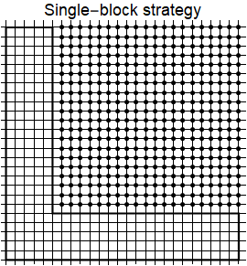

# HiLeMMS Definition

## Assumptions

### key elements and their abstraction of LBM simulation

* **Geometry**
  We assume that the Cartesian grid method (CGM) is employed to describe the geometry of either embedded solid bodies or envelops of flow field.  This technique copes very well with boundary that requiring no knowledge on geometry (e.g., bounce-back scheme), but may cause cumbersome operation if a geometry property (e.g., the normal)  is required.

  

  For internal flows, there is an extra issue in dealing with the geometry body enclosing the flow field. To deal with this issue, there may be three strategies.

  A. **Single-block strategy**, i.e, using a big cube or a rectangle in 2D to enclose all the flow fields and geometries, and describe the geometry by marking node properties.

  

  B. **Multi-block strategy**, similar to the strategy A, but trying to use multiple cubes or rectangles to optimize the memory usage.

  

  C. **Unstructured layout**.  The grid nodes are organized in a unstructured manner by defining neighborhood relationships, which is useful for extremely complicated but sparse network like geometries.

  For both the single-block strategy and the multi-block strategy, a neighborhood node of the current node (i,j,k) can be easily  identified by using relative indexing like (i-1,j,k). While the unstructured layout strategy needs to create a predefined relations between nodes.

  We can now define a few terminologies.

  * **Block**: a cube or a rectangle enclosing the whole or part of geometry and flow field.

  * **Direct addressing**: for a node (i,j,k), its neighbor is (i+1,j,k) .... There is no need to store node relationships.

  * **Virtual boundary**: the "boundary" logically connecting  two or more blocks ( the dashed line in the illustration). Therefore, there is no physical boundary conditions defined but information exchange is required between blocks.

  * **Halo**: an extra layer of nodes that helps to treat physical or virtual boundary.

  * **halo relation**: the connection definition between blocks, i.e., how the information exchange should be conducted.

  * **Indirect addressing**: the node relationship must be created and stored.

  * **Map**: the node relationship for the indirect addressing.

  In this project, **we will first implement our abstraction using the single-block strategy , and expect no difficulty to extend to the multi-block strategy.**

* **Component**

  The component could be a confusing term due to complicated applications.  For a few examples, a multiphase flow may be simulated with only one set of lattices. However,  a single-phase heat transfer may need to two sets of lattices if using double-distribution function (DDF) approach. **To avoid confusion, we define component from the code implementation point of view,** i.e., **the component is corresponding to the lattice set. If an application numerically require two sets of lattices, we say there are two components.** Thus, the DDF approach is considered as multi-component.

  In a typical lattice Boltzmann simulation, a component is associated with a specific lattice set and a few macroscopic variables including density, velocity, temperature etc.  **Each component may have a few properties, e.g.,  viscosity, thermal diffusivity etc**. These properties often determine the relaxation time.

  Since there may be multiple components in a simulation, we need a index for component to help specify the distribution and properties needed by a certain numerical operation.  Moreover, there are many discrete velocities for one component in general. Hence, we need more more index over the discrete velocity space to specify the distribution function, i.e., $f_\alpha^\sigma$ where $\sigma$ is the component index and $\alpha$ is the lattice (discrete velocity) index.

* **Macroscopic variable**
  There are two types of macroscopic variables, moments and others.  **Moments** are obtained by integrating the distribution function over the particle velocity space. For instance, the density is the zeroth order moment. In a number of applications, macroscopic variables other than moments are necessary.  For instance, the so-called solid fraction is introduced. Typically, such variables are not calculated from the distribution function.

  Regular moments can be obtained by pre-defined functions while users must provide user-defined functions.

  A confusing point for regular moments is the treatment of body force terms. If there is a body force, one needs to modify the manner of calculating moment, please refer to Xiaoyi He, Shiyi Chen, and Gary D. Doolen, Journal of Computational Physics, 146, 282-300 (1998).
* **Equilibrium**
  
  Equilibrium function determines the capability of an lattice Boltzmann simulation for various applications, which is of primary importance.

  **Each component will have its own equilibrium function. In general, this equilibrium function depends on moments associated with the component. In some models, it may also depend on the body-force and time step.**

  We will provide several existing form equilibrium function for users to choose using the DefineEquilibrium function. A tricky issue is caused again by the DDF approach for the advection-diffusion problem, where the equilibrium function of the advection-diffusion part depends on the velocity governed by the momentum equations.

  A user-defined function is needed if the user's equilibrium is not predefined. We will be able to automatically generate codes for user-defined functions (as defined in the second phase).

* **Force**
* **Scheme**
  
  Scheme means the numerical discretization for the terms $\partial f/\partial t$ and $\partial f/\partial \bm{r}$. The most popular scheme is the so-called **stream-collision** scheme, which make the method similar to a particle-based solver. For the derivation, please refer to Xiaoyi He, Shiyi Chen, and Gary D. Doolen, Journal of Computational Physics, 146, 282-300 (1998). This scheme will be the primary one for the HiLeMMS system. 

  We can also employ other finite-difference scheme and time integration scheme. In the OPS backend,  we implement the first-order and second-order upwind scheme, and provide a general routine for time integration.

  **We don't plan to support user-defined schemes at this stage.**

* **Initial condition**
  
  A initial condition of a specific problem is in general defined using macroscopic variables varying over space.  For a kinetic theory based method, however, we need to one more initialization  process,  i.e., transformation from macroscopic information into mesoscopic. In this sense, we can have different method, including equilibrium, Chapman-Enskog expansion, etc.
  In this project, **we will introduce a user-defined function, which depends on coordinates, node property etc, to initialize all macroscopic variables. The distribution may be initialized by providing a few default options including the equilibrium one. Of course, a user-defined function can also be introduced.**

* **Boundary condition**
* 
  Boundary may be split into two general types, i.e., the block boundary and the embedded boundary.  A block boundary is defined at a surface of  a block.

* Embedded boundary condition

### Remarks on the implementation

* **Kernel function**
  A kernel function conducts a specific set of operations on a grid node. It will be populated to the whole flow field. Computationally, it is consistent with the definition of kernel function in such as the CUDA context.

  In writing/designing kernel function, it is better to use only C syntax. For instance, std::vector may not be recognized by the compiler for the device like GPU. This becomes a restrictive requirement when we need to deal with different choices of users.
* **User-defined functions**
  A user-defined function (UDF) is introduced by users to implement new functionalities. In general, a UDF will be a kernel function.

* **Code generation**
  Code generation is the process that generates UDFs automatically.

  Before thinking about the code generation, an intermediate step is to find how the UDF should be written.

  Since the code generation may not be able to cover all requirements, it is important to keep facilities for users to write UDFs, e.g., helpful instructions. The tricky point is that many versions UDFs have to be written for various backends.

### Regarding capabilities

1. The Cartesian grid method (CGM) is assumed to be employed to describe the geometry of either embedded solid bodies or envelops of flow field. To reduce memory cost, multi-block technique might be employed if possible. In the future we might be able to support other technique, e.g., finite difference LBM with multi-block structure mesh.
2. By allowing the flexibility in defining macroscopic variables, components (i.e., distribution function), equilibrium term, force term and relaxation times as needed, most of requirements are satisfied for research works in the lattice Boltzmann modelling.
3. The equilibrium and force terms, and relaxation time are assumed to be dependent on distributions, macroscopic variables and their gradients. Extra single parameters can be necessary for cases such as external force.
4. In many cases, it is necessary to allow users to define their own functions for calculating gradients of macroscopic variables.

### Regarding implementation

1. The central idea here is to provide a unified set of facilities for a user or an application developer to utilise existing efforts, e.g., adaptive mesh refinement capability provided by a few libraries.

2. Except for a few enumerated types,  we may not need to define and/or allocate actual data structures as the backend code will be responsible for actually allocating the memory.  A wrapper or code generation tool will be response for translating the requirement to the backend code.

3. For allowing an application developer  to develop new functionalities as described by the above assumptions, it is sufficient to define  a kernel function that will be executed for each computational grid in the physical/particle velocity space. A warp function will call this kernel function and specify the range for it.

4. We may need to have two types of wraps functions, one will go through each spatial grid, the other will also loop over the particle velocity space.

5. Four elementary indexation may be necessary for defining kernel function, i.e., indexation over the particle velocity space, $`\xi=(c_x,c_y,c_z)`$, physical space, $`\Omega=(x,y,z)`$,  the indexation over the component space $`\mathcal{C}`$, and the indexation over the macrosopic ID space $`\mathcal{M}`$.

6. The latter two kind of indexation schemes are due to the flexibility of allowing an application developer to define components and macroscopic etc. A backend code including its wrapper will not know these information beforehand, thus cannot know which component a scheme will operate on, the application developer has to use the indexation mechanism to pass the exact information to the backend code.

7. It may be better not to overuse the sophisticated syntax of C++, i.e., OOP and template considering that they may need to be parsed by very advanced code generation tool. Due to the same reason, wrapper may be preferred over code generation.


## API definition

###  First version : Interface

In this version, we will aim to define a IDSL which provides a unified interface and necessary wrappers for various backend codes. These backend codes may cover different mesh techniques.
####  Preprocessing
**We note that, although there appears no advanced ingredients in this version (cf. the second version), the task could be not easy if a backend code does not allow the flexibility stated by Capability 2**. If this is the case,  considered amount of efforts will be needed to either modify the backend code or develop the wrapper/code generation tool.

Meanwhile, if the capability 2 is realized, we will obtain a natural foundation for implementing the ingredients defined in the Version 2.

```c++
void DefineCase(std::string caseName, const int spaceDim)
//caseName: case name
//spaceDim: 2D or 3D application
```
**Thoughts on DefineCase**

It may be tricky to choose/compile the code for the dimension defined by spaceDim without code generation.

**Description:** The case name will be used as the basis for naming the input file, intermediary files (if any) and output files.

```c++
void DefineProblemDomain(const int blockNum,
                         const int* blockSize)
//blockNum:total number of blocks.
//blockSize: array of integers specifying the block blockSize
```
**Thoughts on problem domain**

Here the block means a square in the 2D case and a cube in the 3D cas from the computational point of view. For instance, a "L" shape 2D pipe may be model by one block with lots of "solid" nodes or two blocks to optimise the memory usage.

For a AMR library, the block size may served as an initial guess to the problem.

AMR may require more parameters including the criteria that judges if a refined mesh is needed in a local area or not. These will subject to further discussions.

**Description:** Defining a "problem domain" comprising of blocks which enclose fluids and other embedded solid bodies if any. A simplest strategy for LBM is to cut a single block and construct the problem domain, which will be supported in the first instance.  In some cases, using multi-block technique could reduce computational costs.

```c++
void DefineBlockBoundary(int blockIndex,
                         BoundarySurface surface,
                         BoundaryType type,
                         Real* value)
//blockIndex: block index
//surface: which surface to set.
//type: boundary condition type
//value: Specified value for the boundary condition
void DefineBlockBoundary(int blockIndex,
                         BoundarySurface surface,
                         BoundaryType type,
                         void* boundaryFunc,
                         int* parameterList)
//boundaryFunc: pointing to a function calculating the
//boundary value
//parameterList: ID list of macroscopic variables, which
//is needed by the boundaryFunc
```

**Description:** Defining the block boundary condition with fixed values. Two enumerated types are concerned: BoundarySurface type distinguishing surface types, including various corner types and BoundaryType distinguishing boundary condition types. For the second version trying to support variable boundary condition, we assume the value depends on macroscopic variable, coordinates and time.

```c++
void AddEmbeddedBody(SolidBodyType type,
                     Real* centrePos,
                     Real* controlParas)
//type: Circle/Sphere,Ellipse/Ellipsoid, superquadrics, ...
//centerPos: the position vector of centre point
//controlParas: control parameters,
//e.g., radius for Circle/Sphere,...
void AddEmbeddedBody(int vertexNum, Real* vertexCoords)
//Add 2D polygon
//vertexNum: total number of vertexes
//vertexCoords: Coordinates of each vertex
void AddEmbeddedBody(std::string STLFileName)
//Add 3D polyhedron through STL file
```

**Description:** Adding embedded solid bodies into the computational domain.

```c++
void DefineEmbeddedBoundary(BoundaryType type, Real* value)
```

**Description:** Defining the type of boundary condition for embedded solid body.

**Assumptions on Halos and their relationships**

The halos are needed for virtual boundaries connected individual blocks and physical boundaries that needed buffers to store temporary information.

If there are multi-blocks in a application, we need to exchange information across virtual boundaries so that we need to define relations of halos.

For most of physical boundary conditions in the OPS-based code, halos are not needed. However, the periodic boundary condition is an exception which needs halos and information exchange.

The required halo depth may be automatically determined by the chosen scheme (the standard stream-Collison scheme needed 1) and the chosen boundary condition.

#### Model
```c++
void DefineComponents(std::vector<std::string> compoNames,
                      std::vector<int> compoId,
                      std::vector<std::string> lattNames)
//compoNames: A vector of string containing component names
//The vector size implies the number of components.
//compoId: A vector containing the component IDs
//must be consecutive and starting from 0
//lattNames: lattice structure associated with each component
void DefineComponents(std::vector<std::string> compoNames,
                      std::vector<int> compoId,
                      int lattDim,
                      std::vector<std::vector<Real>> weights,
                      std::vector<std::vector<Real>> lattPts)
//lattDim: the dimension of lattice structure
//weighs and lattPts as indicated by name.
```

**Description:**  Define the component needed for the simulation. For multi-phase flows or even some thermal flows, we need to use more than one component in general.

```c++
void DefineMacroVars(VariableTypes types,
                     std::vector<std::string> names,
                     std::vector<int> varId,
                     std::vector<int> compoId)
//types: types of macroscopic variables
//names: A vector containing names of macroscopic variables
//varId: A vector containing the ID of variables
// May not be necessary
//compoId: which component the variables belong to
```

**Description:** Define the macroscopic variables needed in the simulation. By specifying types, a backend code will provide default algorithms of calculating them (e.g., density velocity etc.).

```c++
void DefineEquilibriumTerm(EquilibriumType types,
                      std::vector<int> compoId)
//types: which kind of equilibrium function to use
//compoId: which component to act on
```

**Description:** Define the equilibrium which can be calculated by using algorithms provided by the backend code.


```c++
void DefineForceTerm(ForceType types,
                std::vector<int> compoId)
//types: which kind of force function to use
//compoId: which component to act on
```
**Description:**  Define the force term which can be calculated by using algorithms provided by the backend code.
####  Execution

```c++
void Iterate(SchemeType scheme,
        const int steps,
        const int checkPointPeriod)
//scheme: which scheme to use, for implementing such as
//finite difference scheme.
void Iterate(SchemeType scheme,
        const Real convergenceCriteria,
        const int checkPointPeriod)

```

**Description:** Two versions of wraps for running transient or steady simulations.  This wrap will be running all the necessary steps.


### Second version: Customizable ingredients

In this version, we will implement the functionalities allowing customisable ingredients including equilibrium term, force terms etc.

####  Variables and Indexing space

According to the assumptions  Capability 2 and 3, and those of implementation, we can have the following type of variables and the indexation needed by them.

|            Variable Type             | $0$ | $1$ | $2$ | $3$ | Index Type |
| :----------------------------------: | :---: | :------: | :-----------: | :-----------: | :--------: |
|   $0$, $1$, $2$ (force term)    |   ✔︎   |    ✔︎     |       ✔︎       |       ✕       |     A      |
|  $0$, $1$, $2$, $3$ (weight)   |   ✔︎   |    ✕     |       ✔︎       |       ✕       |     B      |
| $0$,  $1$, $2$, $3$, $4$ etc |   ✕   |    ✔︎     |       ✔︎       |       ✔︎       |     C      |
|            $0$, $1$, $2$             |   ✕   |    ✔︎     |       ✕       |       ✕       |     D      |

#### Indexation type

1. **Relative indexation** means the starting point for indexation is the current  local point, e.g., for the Coordinate $`x`$, 0 means current point,, -1 the left side, 1, the right side.

2. **Absolute indexation** gives the absolute index of a variable. For example, $`\textbf{c}_1`$ with an absolute index could  the 1st discrete velocity within the lattice structure.

In general the indexation schemes in $`\xi`$ , $`\mathcal{C}`$ and $`\mathcal{M}`$ are likely to be absolute, and the one in $`\Omega`$ may be relative.

For absolute indexation, the application developer will be responsible for defining loop type of operation.

For relative indexation, the loop type operation will be conducted automatically by the HiLeMMS loop wrapper and therefore by the underlying library.

#### Loop over indexing space

Assuming the domain decomposition is used for parallelisation, we will need to have such a loop function that iterates the operation defined by users over the space $`\Omega`$, i.e., hides the underlying details for parallelism.

In general a reasonable underlying library will provide similar facilities for this purpose. Hence, the loop function is to provide necessary wrapper or code generation tool for the translation.

#### Assumptions on the

#### Indexing functions

```c++
// A type indexing
CompoVeloSpaIdx (int componId, int veloId, int i, int j, int k)
```
```c++
//B type indexing
CompoVelodx(int componId, int veloId)
```
```c++
//C type indexing
CompoMacroSpaIdx(int componId, int macroVarId, int i, int j, int k)
```
```c++
// D type indexing
SpaIdx(int i, int j, int k)
```

These functions are the key part, C/C++ macros might be a way  for implementation.

#### An example kernel function for  a “new“ equilibrium

Assuming the equilibrium reads
$`
f_\alpha =w_\alpha \rho_\alpha \left( {\textbf{c}_\alpha} \cdot \textbf{V}+\frac{du}{dx}\right)
`$

The code may looks that

```c++
//all ID demostrated as varialbs are absolute indexation.
//those in number literials are relative indexation.
f[CompoVeloSpaIdx(compoId, xiIdx, 0, 0, 0)] =
w[CompoVeloIdx(compoId,xiIdx)]*macroVars[CompoMacroSpaIdx(compoId,idOfRho,0,0,0)]*(
cx[CompoVeloIdx(compoId,xiIdx]*macroVars[CompoMacroSpaIdx(compoId,idOfu,0,0,0)]+
cy[CompoVeloIdx(compoId,xiIdx]*macroVars[CompoMacroSpaIdx(compoId,idOfv,0,0,0)]+
cz[CompoVeloIdx(compoId,xiIdx]*macroVars[CompoMacroSpaIdx(compoId,idOfw,0,0,0)]+
(macroVars[CompoMacroSpaIdx(compoId,idOfu,0,0,0)]-macroVars[CompoMacroSpaIdx(compoId,idOfu,-1,0,0)])/(X[SpaIdx(0,0,0)]-X[SpaIdx(-1,0,0)])
)
```


## Enumerated types

```c++
enum VariableTypes {
    Variable_Rho = 0,//Density
    Variable_U = 1,//velocity
    Variable_V = 2,//velocity
    Variable_W = 3,//velocity
    Variable_T = 4, //temperature
    Variable_Qx = 5, //heat flux
    Variable_Qy = 6, //heat flux
    Variable_Qz = 7, //heat flux
    Variable_Sigmaxx =8,//shear stress
    Variable_Sigmaxy =9,//shear stress
    Variable_Sigmaxz =10,//shear stress
    Variable_Sigmayy =11,//shear stress
    Variable_Sigmayz =12,//shear stress
    Variable_Sigmazz =13,//shear stress
    // variables that not calculated by using distribution
    Variable_Independent =-1,
    // variables calculated by using self-defined althrithm
    Variable_SelfDefined = -2
};
```

